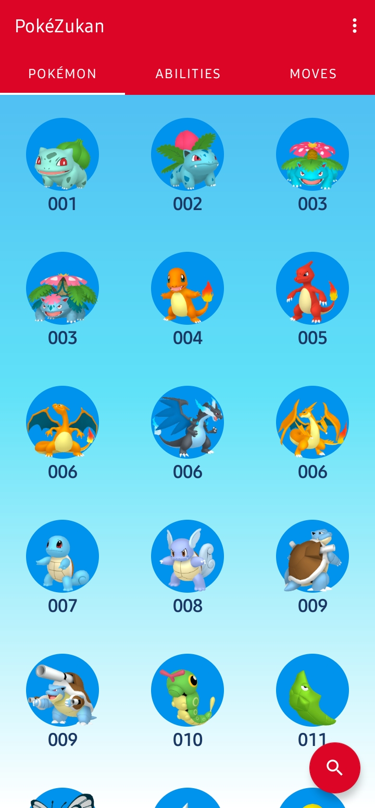
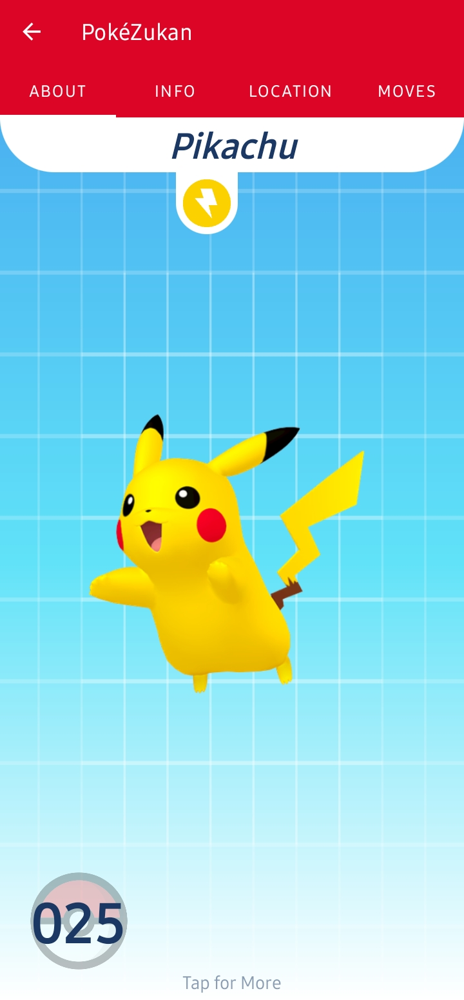
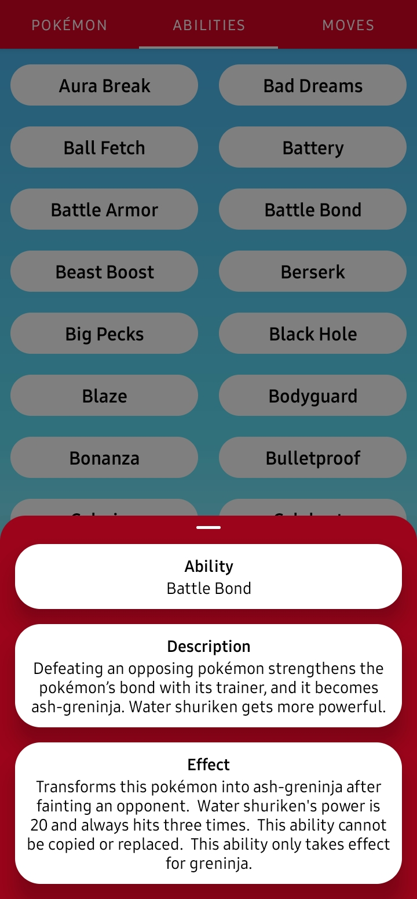
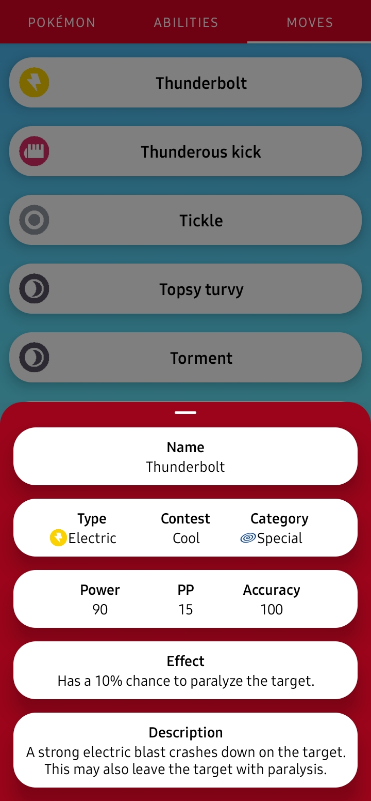

# PokeZukan

Simple and easy to use encyclopedia for Pokémon.  

## Project Overview

PokeZukan is an unofficial app that offers a free and minimalistic Pokédex.  
It is especially catered for beginners starting the Pokémon game with the basic information needed to progress their journey.  
Network connection is needed as data is retrieved from [PokeZukanAPI](https://github.com/glennkok1501/PokeZukanAPI).  
**DISCLAIMER**  
PokeZukan is an unofficial, free fan made app and is not affiliated, endorsed or supported by Nintendo, GAME FREAK or The Pokémon Company in any way. Some images used in this app are copyrighted and are supported under fair use. Arts, visuals, names, Pokémon and Pokémon names are properties of the companies mentioned previously.  
No copyright or trademark infringement is intended.  
© 2021 Pokémon.  
© 1995–2021 Nintendo/Creatures Inc./GAME FREAK inc.  

## Features
- View Pokémon entries such as stats, location, and moves.  

- Learn about the different Abilities each Pokémon has.  

- Study a variety of moves used in the Pokémon world.  

